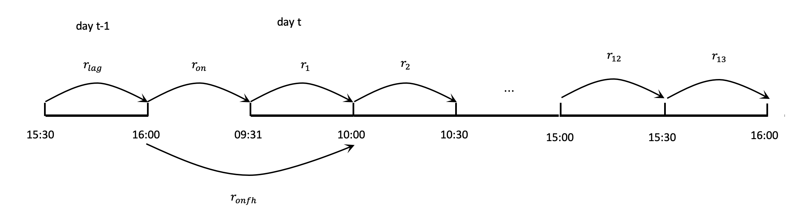
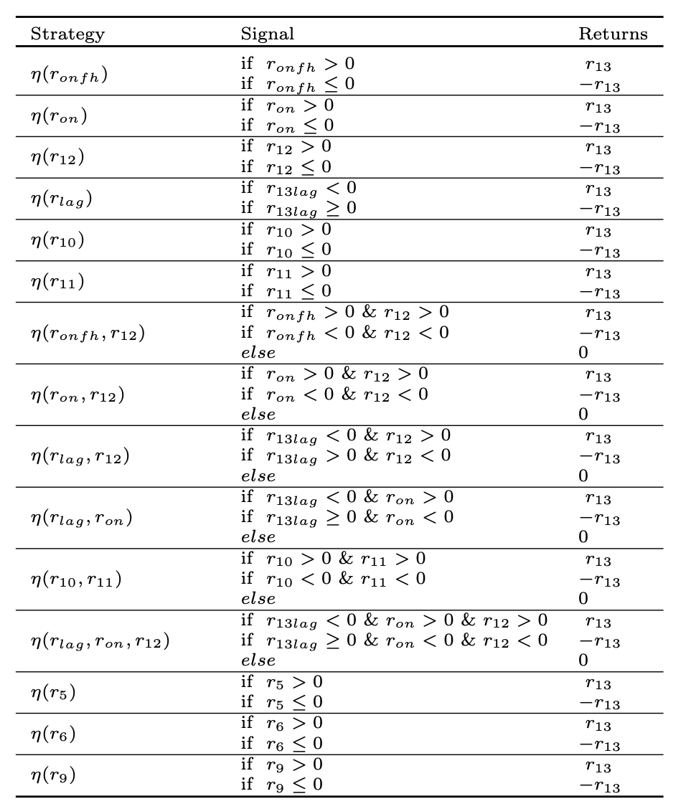
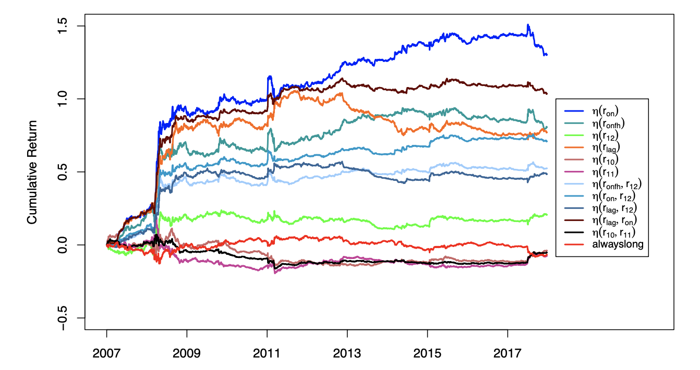
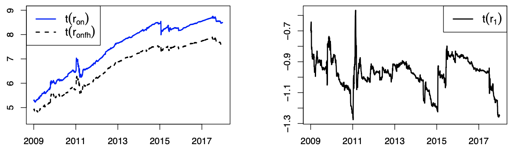

# Market Intraday Momentum

## Introduction
Many research have recently been conducted to investigate the factors that influence return behavior during the last half-hour of trading sessions. Motivated by [[1]](#1) and [[2]](#2), we are investigating market intraday momentum, with a particular emphasis on the predictability of last half-hour returns. 

## Multiple Linear Regression

The multiple linear regression model with default Gaussian error terms has been frequently used in the literature review, such as [[1]](#1), [[2]](#2), [[3]](#3) and among others. 

To begin, consider the various half-hour returns, as seen in the figure below.

Our target variable is $r_{13}$, representing the last half-hour return. All of the other returns are exploratory variables. To avoid multicollinearity concerns, $r_{on}$ and $r_1$ will not result in $r_{onfh}$ in the same linear model. Specifically, we consider two distinct multivariate linear models as follows:

$$
    r_{13,t} = \beta_{0} + \beta_{lag,t}r_{lag,t}+\beta_{on,t}r_{on,t}+\beta_{1,t}r_{1,t}+\dots+\beta_{12,t}r_{12,t}+\epsilon_t
$$

$$
    r_{13,t} = \beta_{0} + \beta_{lag,t}r_{lag,t}+\beta_{onfh,t}r_{onfh,t}+\beta_{2,t}r_{2,t}+\dots+\beta_{12,t}r_{12,t}+\epsilon_t
$$

## Data
The sample SPY runs from August 2008 to July 2018. We monitored open, closed, high, and low prices, as well as volume, at 1-minute intervals. The data was screened to ensure that it included the entire daily trading period, which ran from 9:30 a.m. to 4:00 p.m.

## Analytical Results

The findings from the multivariate linear model (MLR)indicate that, with the variables of interest controlled for, the subsequent explanatory variables exhibited statistical significant at a 5% level of significance: $r_{lag}$, $r_{on}$, $r_{onfh}$, $r_{2}$, $r_{3}$, $r_{5}$, $r_{7}$, $r_{10}$ and $r_{12}$.

| Model_1 | Est.| t-value |  Sig.|  Model_2 | Est. | t-value |  Sig.| 
| :---:   | :---: | :---: |  :---: |  :---:   | :---: | :---: |  :---: |
| $r_{lag}$ | -0.16   | -8.43  |  ***|  $r_{lag}$ | -0.15  | -8.23   |  ***|
| $r_{on}$ | 0.08   | 8.34   |  ***|  $r_{on}$ | - | - |  |
| $r_{1}$ | -0.02   | -1.16   | |  $r_{1}$ |  - | - |  |
| $r_{onfh}$ | -  | -  |  |  $r_{onfh}$ | 0.07  | 7.491   | ***|
| $r_{2}$ | 0.08   | 3.24   | **|  $r_{2}$ | 0.08   | 3.23  |  **|
| $r_{3}$ | 0.12   | 4.55  |  ***|  $r_{3}$ | 0.12  | 4.48  |  ***|
| $r_{4}$ | 0.02   | 0.70   |  |  $r_{4}$ | 0.02  | 0.62  | |
| $r_{5}$ | 0.12   | 3.66   |  *** |  $r_{5}$ | 0.13 | 3.76   | ***|
| $r_{6}$ | 0.05   | 1.38   |  |  $r_{6}$ | 0.04   | 1.16  |  |
| $r_{7}$ | -0.12   | -3.30  |  ***|  $r_{7}$ | -0.14 | -3.80 |  ***|
| $r_{8}$ | -0.01   | -0.23  |  |  $r_{8}$ | -0.01  | -0.347  | |
| $r_{9}$ | -0.05   | -1.55   |  | $r_{9}$ | -0.06 | -1.73   |  |
| $r_{10}$ | 0.07   | 2.32   | * |  $r_{10}$ | 0.07  | 2.30 | * |
| $r_{11}$ | 0.02   | 0.81  |  |  $r_{11}$ | 0.01 | 0.357  |  |
| $r_{12}$ | 0.17   | 7.63  |  *** |  $r_{12}$ | 0.17  | 7.58 |  ***|
| $R^{2}$(%) | 10.05   |-  |  | $R^{2}$(%) | 9.77   | -  |  |
| $adjR^{2}$(%) | 10.04   | -   | |  $adjR^{2}$(%) | 9.34  | - |  |

## Back-Testing
Backtesting economic performance is one method for evaluating a predictor's efficiency. We created some trading techniques using the observed results of multivariate linear models. In particular, we initiate a long or short position at the start of the last half-hour trading window and terminate it at the conclusion of the stock market if the trade signal is significant.

The table below provides summary data on the returns obtained by the suggested strategy.  Using $r_{on}$ as a signal for trading in the past half-hour yields an average daily return of 0.031%.

Below are the cumulative returns for each strategy.

## Discussion

This repo was motivated by article [[1]](#1) but got some new findings. First, compared to $r_{onfh}$ (trading signal proposed by [[1]](#1)), $r_{on}$ may have stronger signals and produce higher returns and sharp ratios. We utilized iterative sequential growing windows MLR (ISG-MLR) to confirm our conjunction. Below are the t-statistics for $r_{on}$, $r_{onfh}$ and $r_1$ ($r_{onfh}=r_{on}+r_{1}$) from the (ISG-MLR). We can observe that the t-statistic of $r_{on}$ is always greater than $r_{onfh}$, and the absolute value of the t-statistic of $r_1$ is under 1.96. In other words, $r_1$ here is more like noise to disturb the performance of $r_{onfh}$ to catch up $r_{on}$.

Second, we used fix-windows MLR and argued for a dynamic trading strategy; the dynamic t-statistics for each explanatory variable are shown below. Above or below the red line implies that they are significant at the 5% level.

Finally, we also conducted model diagnosis and found that MLR may not be the best model to observe market intraday momentum. Thus, we extended our study to more complicated models and more suitable trading strategies and summarized them in a new paper titled "Market Predictability Before The Closing Bell Rings." We submitted this article to the Journal of Finance and Data Science; its current status is under review.  
 
## Refrence
<a id="1">[1]</a> 
Gao, L., Han, Y., Li, S. Z., & Zhou, G. (2018). Market intraday momentum. Journal of Financial Economics, 129(2), 394-41

<a id="2">[2]</a> 
Baltussen, G., Da, Z., Lammers, S., & Martens, M. (2021). Hedging demand and market intraday momentum. Journal of Financial Economics, 142(1), 377-403.

<a id="3">[3]</a> Ho, T., Lv, J. R., & Schultz, E. (2021). Market intraday momentum in Australia. Pacific-Basin Finance Journal, 65, 101499.